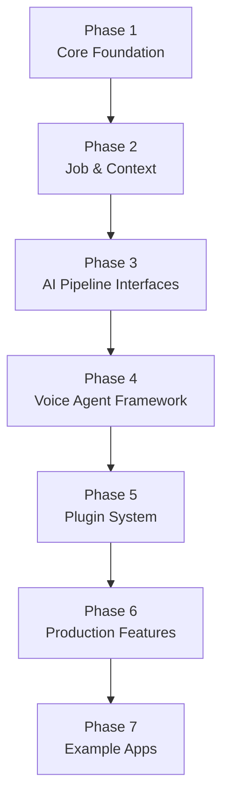

<!--
Copyright 2024 LiveKit

Licensed under the Apache License, Version 2.0 (the "License");
you may not use this file except in compliance with the License.
You may obtain a copy of the License at

    http://www.apache.org/licenses/LICENSE-2.0

Unless required by applicable law or agreed to in writing, software
distributed under the License is distributed on an "AS IS" BASIS,
WITHOUT WARRANTIES OR CONDITIONS OF ANY KIND, either express or implied.
See the License for the specific language governing permissions and
limitations under the License.
-->

# Go LiveKit Agents – Implementation Plan (Go 1.24)

This documentation set lays out an **end-to-end, phase-by-phase guide** for building a Go implementation that tracks the Python LiveKit Agents library feature-for-feature while remaining idiomatic Go.

Junior developers should be able to follow every step without making architectural decisions on their own – all critical choices are already made here.

---

## Phase Table

| # | Phase | Doc | High-level Output |
|---|-------|-----|-------------------|
| 1 | Core foundation | [phase-1_core_foundation.md](phase-1_core_foundation.md) | CLI skeleton, worker, logging & WebSocket layer |
| 2 | Job & context management | [phase-2_job_context_management.md](phase-2_job_context_management.md) | Job object model, LiveKit room abstraction |
| 3 | AI pipeline interfaces | [phase-3_ai_pipeline_interfaces.md](phase-3_ai_pipeline_interfaces.md) | STT/TTS/LLM/VAD Go interfaces & mocks |
| 4 | Voice agent framework | [phase-4_voice_agent_framework.md](phase-4_voice_agent_framework.md) | Conversation/Session engine |
| 5 | Plugin system | [phase-5_plugin_system.md](phase-5_plugin_system.md) | Dynamic plugin registration & packaging |
| 6 | Production features | [phase-6_production_features.md](phase-6_production_features.md) | Observability, rate-limits, hardening |
| 7 | Example applications | [phase-7_example_applications.md](phase-7_example_applications.md) | Ported Python examples + new demos |

---

## Conventions Used Throughout

* **CLI namespace:** `lk-go` – mirrors the Python `lk` binary.
* **Logging:** `log/slog` with JSON output by default.
* **Testing style:** Go standard library + `got/want` comments. No third-party test frameworks.
* **License header:** Apache-2 across code & docs.
* **Docs language:** Markdown (CommonMark) with Mermaid permitted.

---

## How to Read These Docs

1. Read each phase document **in order** – later phases build on earlier artifacts.
2. Each phase ends with **Acceptance Criteria** – CI must pass before starting the next phase.
3. For quick navigation use the sidebar on GitHub or the table above.

Happy building! :rocket: 