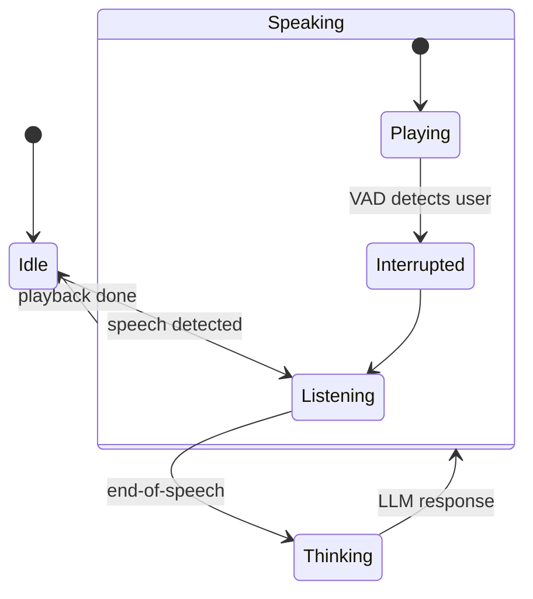

<!--
Copyright 2024 LiveKit

Licensed under the Apache License, Version 2.0 (the "License");
you may not use this file except in compliance with the License.
You may obtain a copy of the License at

    http://www.apache.org/licenses/LICENSE-2.0

Unless required by applicable law or agreed to in writing, software
distributed under the License is distributed on an "AS IS" BASIS,
WITHOUT WARRANTIES OR CONDITIONS OF ANY KIND, either express or implied.
See the License for the specific language governing permissions and
limitations under the License.
-->

# Phase 4 – Voice Agent Framework

> Timeline target: **Week 7–8**

Glue the audio pipeline and LLM logic into a reusable Agent base class.

---

## 1. Goals & Deliverables

| ID | Deliverable | Description |
|----|-------------|-------------|
| P4-D1 | `pkg/agent` | `Agent` struct with `Start(ctx Job)` / `Interrupt()` / `Close()` |
| P4-D2 | Session state machine | Tracks `Idle → Listening → Thinking → Speaking` |
| P4-D3 | Interruption handling | VAD-based cut-off mid sentence |
| P4-D4 | Background audio support | Optional looping track mixed in |
| P4-D5 | CLI `lk-go agent demo` | Minimal example agent (echo bot) |

---

## 2. Architecture Diagram

---

## 3. Implementation Steps

1. **Finite State Machine** – implement using `iota` enum + `sync/atomic` currentState.
2. **Audio Routing** – channels:
   * `micIn <-chan rtc.AudioFrame`
   * `ttsOut chan<- rtc.AudioFrame`
3. **Agent Loop** – select over VAD events, LLM future, and playback completion.
4. **Interruption** – on `VADEvent.SpeechStart` during Speaking, cancel TTS stream and transition.
5. **Metrics hooks** – expose `FirstWordLatency`, `SessionDuration` via `expvar` for now.

---

## 4. Testing Strategy

### 4.1 Unit Tests

* Simulate synthetic VAD + STT events, ensure FSM transitions.
* Race-condition test under `go test -race` with 1000 random event streams.

### 4.2 Golden Audio Test

* Feed prerecorded WAV (`tests/change-sophie.wav`), expect LLM reply within 1 s.

---

## 5. Acceptance Criteria

* FSM never panics on unknown transition (cover with default branch).
* `lk-go agent demo` joins room, repeats user speech back with ≤300 ms added latency on local LAN.
* All metrics exported at `/metrics` HTTP handler when `--metrics` flag set.

---

## 6. Python Reference

| Feature | Python Source | Go Mapping |
|---------|---------------|-----------|
| Agent session | `agents.voice.agent.AgentSession` | `pkg/agent.Session` |
| FSM | `voice.room_io._state_machine` | this FSM |

---

_After acceptance proceed to [Phase 5 – Plugin System](phase-5_plugin_system.md)._ 